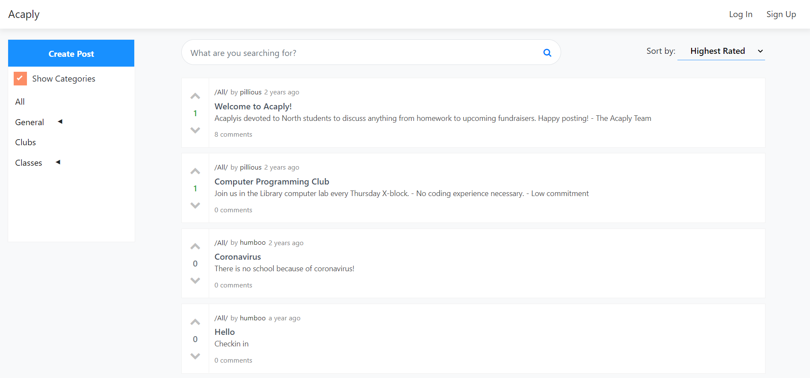

<div id="top"></div>

<!-- PROJECT LOGO -->
<br />
<div align="center">
<h3 align="center">Acaply</h3>

  <p align="center">
    An online forum for students.
    <br /><br />
    <a href="https://acaply.humpillious.vercel.app/">View Demo</a>
  </p>
</div>

<!-- About -->

## 💡 About The Project



### Motivation

My motivation for building Acaply was to primarily understand the interactions between the server side and client side portions of a feature-dense application.

### Challenges

### Built With

-   Server: Node.js/Express, Javascript, Mongoose
-   UI: HTML, CSS, EJS.
-   Database: MongoDB
-   Other: SendGrid, Vercel, MongoDB Atlas

<p align="right">(<a href="#top">back to top</a>)</p>

<!-- GETTING STARTED -->

## 🚀 Getting Started

[Live Demo](acaply.humpillious.vercel.app/)
<br>
To get a local copy up and running follow these steps.

### Prerequisites

1. NPM is required to run this project.

    ```sh
    npm install npm@latest -g
    ```

2. Create a free MongoDB database using [Atlas](https://www.mongodb.com/cloud).

### Installation

1. Clone the repo
    ```sh
    git clone https://github.com/pillious/Acaply.git
    ```
2. Install NPM packages
    ```sh
    cd Acaply
    npm install
    ```
3. Create a `.env` file inside the root directory.
4. Add environment variables to `.env`
    ```sh
    DATABASE_USERNAME=[your_mongodb_atlas_username]
    DATABASE_PASSWORD=[your_mongodb_atlas_password]
    USER_SESSION_KEY=[encryption_key*]
    SENDGRID_API_KEY=[your_sendgrid_api_key]
    RESET_PASSWORD_EMAIL_ID=[sendgrid_email_id]
    ```
    \* [Randomly generate encryption key](https://www.allkeysgenerator.com/Random/Security-Encryption-Key-Generator.aspx)
5. Run the project on `localhost:3000`
    ```sh
    npm start
    ```
    [Deploy using vercel](https://vercel.com/docs/concepts/deployments/overview)

<p align="right">(<a href="#top">back to top</a>)</p>

<!-- USAGE EXAMPLES -->

<!-- ## Usage

Use this space to show useful examples of how a project can be used. Additional screenshots, code examples and demos work well in this space. You may also link to more resources.

_For more examples, please refer to the [Documentation](https://example.com)_

<p align="right">(<a href="#top">back to top</a>)</p> -->

<!-- LICENSE -->

## ⚖️ License

Distributed under the MIT License. See `LICENSE.txt` for more information.

<!-- CONTACT -->

## 🎯 Contact

Andrew Lee (pillious) - andrewzhlee@gmail.com
<br>
([My Website](https://andrewzh.com))

<!-- ACKNOWLEDGMENTS -->

## 📚 Acknowledgments

-   [Electron Template with Next.js & Typescript](https://github.com/vercel/next.js/tree/canary/examples/with-electron-typescript)

<p align="right">(<a href="#top">back to top</a>)</p>
