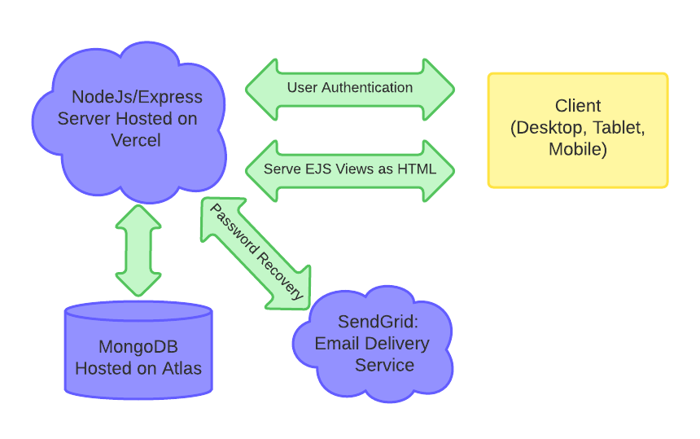
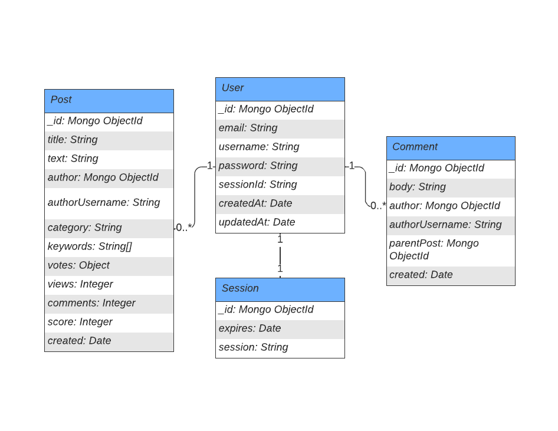

<div id="top"></div>

<!-- PROJECT LOGO -->
<br />
<div align="center">
<h3 align="center">Acaply</h3>

  <p align="center">
    An online forum for students.
    <br /><br />
    <a href="https://acaply-alpha-fawn.vercel.app/">View Demo</a>
  </p>
</div>

<details>
  <summary>Table of Contents</summary>
  
  - [About the Project](#-about-the-project)
    - [Motivation](#motivation)
    - [Challenges](#challenges)
    - [Built With](#built-with)
  - [Architecture](#architecture)
  - [Getting Started](#-getting-started)
    - [Prerequisites](#prerequisites)
    - [Installation](#installation)
  - [License](#-license)
  - [Contact](#-contact)
</details>

<!-- About -->

## 💡 About the Project


### Motivation

My motivation for building Acaply was to primarily understand the interactions between the server side and client side portions of a feature-dense application.

### Challenges

The most challenging aspect of the project was handling user authentication and managing user sessions. I learned how to setup secure signup, login, session, and password reset features. In addition, with the help of mongoose and bcrpyt, I also learned the process of storing user data and hashing account passwords.

<!-- TODO -->

Another obstacle I initially faced was the structure of my database.

### Built With

-   Server: Node.js/Express, Javascript, Mongoose
-   UI: HTML, CSS, EJS.
-   Database: MongoDB
-   Other: SendGrid, Vercel, MongoDB Atlas

<p align="right">(<a href="#top">back to top</a>)</p>

<!-- Architecture -->

## Architecture

<center>Application Architecture</center>
<div align="center">
    
</div>
<br/>
<center>Database Structure</center>
<div align="center">
    
</div>

<p align="right">(<a href="#top">back to top</a>)</p>

<!-- GETTING STARTED -->

## 🚀 Getting Started

[Live Demo](https://acaply-alpha-fawn.vercel.app/)
<br>
To get a local copy up and running follow these steps.

### Prerequisites

1. NPM is required to run this project.

    ```sh
    npm install npm@latest -g
    ```

2. Create a free MongoDB database using [Atlas](https://www.mongodb.com/cloud).

### Installation

1. Clone the repo
    ```sh
    git clone https://github.com/pillious/Acaply.git
    ```
2. Install NPM packages
    ```sh
    cd Acaply
    npm install
    ```
3. Create a `.env` file inside the root directory.
4. Add environment variables to `.env`
    ```sh
    DATABASE_USERNAME=[your_mongodb_atlas_username]
    DATABASE_PASSWORD=[your_mongodb_atlas_password]
    USER_SESSION_KEY=[encryption_key*]
    SENDGRID_API_KEY=[your_sendgrid_api_key]
    RESET_PASSWORD_EMAIL_ID=[sendgrid_email_id]
    ```
    \* [Randomly generate encryption key](https://www.allkeysgenerator.com/Random/Security-Encryption-Key-Generator.aspx)
5. Run the project on `localhost:3000`
    ```sh
    npm start
    ```
    [Deploy using Vercel](https://vercel.com/docs/concepts/deployments/overview)

<p align="right">(<a href="#top">back to top</a>)</p>

<!-- LICENSE -->

## ⚖️ License

Distributed under the MIT License. See `LICENSE.txt` for more information.

<!-- CONTACT -->

## 🎯 Contact

Andrew Lee (pillious) - andrewzhlee@gmail.com
<br>
([My Website](https://andrewzh.com))

<p align="right">(<a href="#top">back to top</a>)</p>
